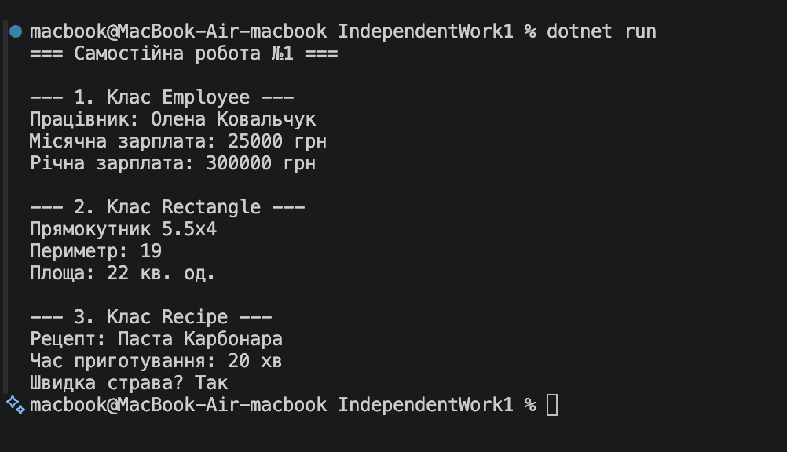

# Самостійна робота №1

**Тема:** Базовий синтаксис C# і оголошення класів.

## Хід роботи

1. Створено консольний проєкт `IndependentWork1`.
2. Реалізовано 3 власні класи:
   - `Employee`: приватні поля, властивість `MonthlySalary` (read-only), метод `CalculateAnnualSalary()`.
   - `Rectangle`: приватні поля, властивість `Perimeter` (read-only), метод `CalculateArea()`.
   - `Recipe`: приватні поля, властивість `CookingTimeMinutes` (read-only), метод `IsQuickRecipe()`.
3. У `Program.cs` продемонстровано створення екземплярів класів та виклики їхніх методів.

## Результат

## Відповіді на контрольні запитання

1. **Які мінімальні елементи повинен містити клас у цьому завданні?**  
   Клас повинен містити щонайменше 2 приватних поля, публічні властивості (включаючи read-only), конструктор з параметрами та метод, що реалізує обчислювальну або перевірочну логіку.

2. **Чому поля доцільно робити приватними, а доступ до них надавати через властивості?**  
   Це принципи інкапсуляції. Приватні поля захищають внутрішній стан об'єкта від неузгоджених змін ззовні, а властивості дозволяють контролювати та валідувати читання й запис даних.

3. **Для чого в класі потрібен конструктор і як він пов'язаний зі станом об'єкта?**  
   Конструктор призначений для ініціалізації об'єкта під час його створення. Він задає початковий коректний стан об'єкта (значення його полів).

4. **Як у Main показати, що методи класу працюють коректно?**  
   Необхідно створити об'єкт класу, передавши початкові дані через конструктор, викликати його методи та вивести отримані результати в консоль за допомогою `Console.WriteLine()`.