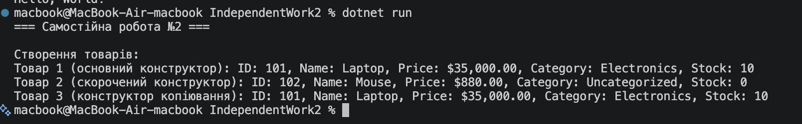

# Самостійна робота №2

**Тема:** Перевантаження конструкторів: приклади та сценарії.

## Хід роботи

1. Створено консольний проєкт `IndependentWork2`.
2. Реалізовано клас `Product` із 5 read-only властивостями (`Id`, `Name`, `Price`, `Category`, `StockCount`).
3. Додано 3 перевантажені конструктори:
   - Основний конструктор (приймає всі 5 параметрів).
   - Скорочений конструктор (приймає `id`, `name`, `price` та викликає основний через `this(...)` із значеннями за замовчуванням).
   - Конструктор копіювання (приймає об'єкт `Product` та викликає основний через `this(...)`).
4. Перевизначено метод `ToString()` для форматованого виводу інформації про товар.
5. У `Program.cs` продемонстровано створення об'єктів за допомогою кожного з конструкторів.

## Результат

## Відповіді на контрольні запитання

1. **Навіщо потрібне перевантаження конструкторів у класі Product?**  
   Перевантаження конструкторів забезпечує гнучкість при створенні об'єктів. Це дозволяє створювати екземпляри класу з різним рівнем деталізації даних (наприклад, коли відомі лише базові характеристики товару або коли потрібно створити точну копію існуючого об'єкта).

2. **Чому конструктор копіювання зручно реалізовувати через this(...)?**  
   Використання `this(...)` запобігає дублюванню коду (принцип DRY). Замість повторного написання логіки присвоєння значень усім полям, конструктор копіювання просто передає властивості об'єкта-джерела в основний конструктор.

3. **Які переваги дає read-only доступ до властивостей після створення об'єкта?**  
   Read-only властивості роблять об'єкт незмінним (immutable) після його створення. Це підвищує надійність коду, гарантує цілісність даних та захищає від випадкової модифікації характеристик товару в інших частинах програми.

4. **У яких випадках перевизначення ToString() спрощує налагодження та демонстрацію роботи класу?**  
   Перевизначення `ToString()` дозволяє отримати зрозуміле текстове представлення об'єкта при передачі його в `Console.WriteLine()` або при перегляді в налагоджувачі (debugger), позбавляючи потреби вручну виводити кожне поле окремо.