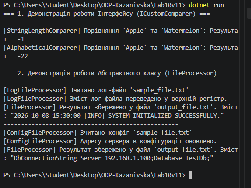

# Лабораторна робота №10 (Варіант 11)

**Тема:** Абстрактні класи та інтерфейси. Контракти та реалізації.

## Хід роботи

1. Створено консольний проєкт `Lab10v11`.
2. Реалізовано інтерфейс `ICustomComparer<T>` з методом `Compare(T x, T y)` та дві його реалізації:
   - `StringLengthComparer` (порівняння за довжиною рядка).
   - `AlphabeticalComparer` (порівняння за алфавітом).
3. Реалізовано абстрактний клас `FileProcessor` з абстрактними методами `ReadFile` і `ProcessContent`, та конкретним методом `WriteResult`.
4. Створено два похідні класи:
   - `LogFileProcessor`
   - `ConfigFileProcessor`
5. У методі `Main` продемонстровано поліморфну роботу через колекції типу інтерфейсу та базового абстрактного класу.

## Результат виконання

