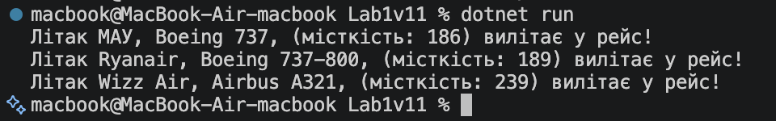

# Лабораторна робота №1

### Тема
Створення першого проєкту. Класи, об'єкти, конструктори та деструктори. Середовище розробки

### Хід роботи
1. У середовищі Visual Studio Code створила новий консольний проєкт на C# за допомогою команди `dotnet new console`.
2. Реалізувала клас `Plane` (Варіант 11), який містить:
   - Закриті поля `airline` (авіакомпанія) та `model` (модель літака).
   - Властивість `Capacity` для роботи з місткістю пасажирів.
   - Конструктор із параметрами для ініціалізації об'єкта та деструктор.
   - Метод `Fly()`, який виводить інформацію про політ літака у консоль.
3. У головному класі `Program` створила кілька екземплярів класу `Plane` із різними даними та викликала їхні методи.
4. Перевірила роботу програми через термінал за допомогою команди `dotnet run`.
5. Створила Git-репозиторій, додала необхідні файли та файл `.gitignore`, а потім завантажила проєкт на GitHub.

### Результати

В результаті виконання роботи було засвоєно базові принципи об'єктно-орієнтованого програмування на C#. Програма успішно компілюється та виводить у консоль інформацію про створені об'єкти літаків, після чого об'єкти коректно вивантажуються з пам'яті. Код повністю збережено у GitHub-репозиторії.