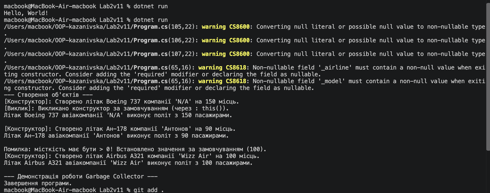

# Лабораторна робота №2

**Тема:** Клас із кількома конструкторами. Життєвий цикл об'єкта.  

### Хід роботи
1. Створила новий консольний проєкт `Lab2v11` у середовищі VS Code.
2. Реалізувала клас `Plane` із закритими полями, властивостями з валідацією (`Capacity > 0`), конструкторами із ланцюговим викликом (`: this()`) та деструктором.
3. У методі `Main` продемонструвала створення об'єктів, роботу валідації та примусове очищення пам'яті через `GC.Collect()`.

### Результати виконання

### Відповіді на контрольні запитання
1. **Що таке перевантаження конструкторів і яку перевагу воно дає?**  
   Це можливість оголошувати в одному класі кілька конструкторів із різними параметрами для гнучкого створення об'єктів.
2. **Як за допомогою `: this()` можна уникнути дублювання коду?**  
   Один конструктор викликає інший конструктор того ж класу, уникаючи повторення коду ініціалізації.
3. **Хто і в який момент викликає деструктор?**  
   Деструктор викликається автоматично збирачем сміття (Garbage Collector), коли на об'єкт немає посилань.
4. **Чому в реальних програмах не рекомендується викликати `GC.Collect()` вручну?**  
   Це порушує внутрішню оптимізацію .NET та може суттєво знизити продуктивність програми.