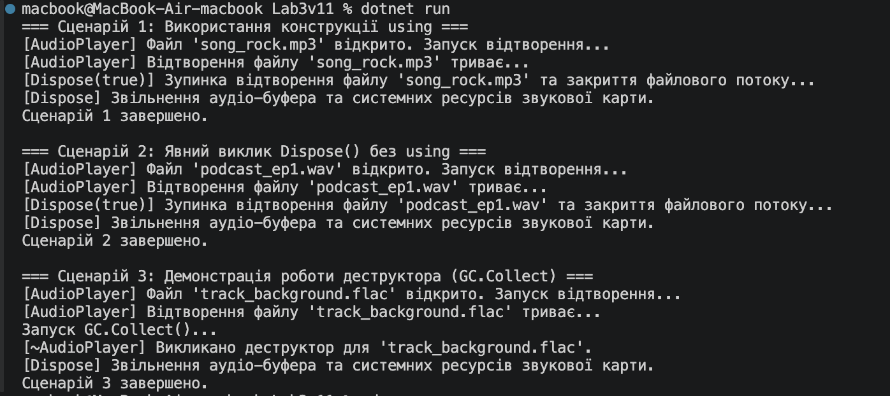

# Лабораторна робота №3

**Тема:** Життєвий цикл об'єкта та керування ресурсами.  

## Хід роботи
1. Створено новий консольний проект `Lab3v11`.
2. Реалізовано клас `AudioPlayer`, який підтримує інтерфейс `IDisposable` та повноцінний паттерн `Dispose`.
3. У методі `Main` продемонстровано три сценарії використання:
   - З використанням оператора `using`.
   - З явним викликом методу `Dispose()`.
   - Зі створенням об'єкта без збереження посилання та примусовим викликом деструктора через `GC.Collect()`.

## Результат

## Відповіді на контрольні запитання

1. **Що таке життєвий цикл об'єкта в .NET?**  
   Це послідовність етапів життя об'єкта: виділення пам'яті в купі (heap) через конструктор, виконання коду (використання) та звільнення пам'яті Збирачем Сміття (Garbage Collector).

2. **Яка різниця між керованими та некерованими ресурсами?**  
   Керовані ресурси — це об'єкти .NET, пам'ять під які очищається автоматично через GC. Некеровані ресурси (файли, сокети, звукові буфери, з'єднання з БД) вимагають явного закриття вручну за допомогою паттерну `Dispose`.

3. **Для чого призначений інтерфейс `IDisposable`?**  
   Для забезпечення стандартного механізму явного та негайного звільнення некерованих ресурсів через метод `Dispose()`.

4. **Як оператор `using` допомагає в керуванні ресурсами?**  
   Оператор `using` гарантує виклик методу `Dispose()` одразу після виходу з блоку коду, навіть у разі виникнення виняткових ситуацій (помилок).

5. **Навіщо в патерні `Dispose` використовується `GC.SuppressFinalize(this)`?**  
   Він скасовує виклик деструктора (фіналізатора) для об'єкта, якщо ресурси вже були успішно звільнені вручну, що оптимізує продуктивність програми.

6. **Чому в деструкторі викликається `Dispose(false)`, а в методі `Dispose()` — `Dispose(true)`?**  
   `Dispose(true)` викликається користувачем і очищає як керовані, так і некеровані ресурси. `Dispose(false)` викликається деструктором/GC, коли керовані об'єкти вже могли бути зібрані, тому очищати можна тільки некеровані ресурси.