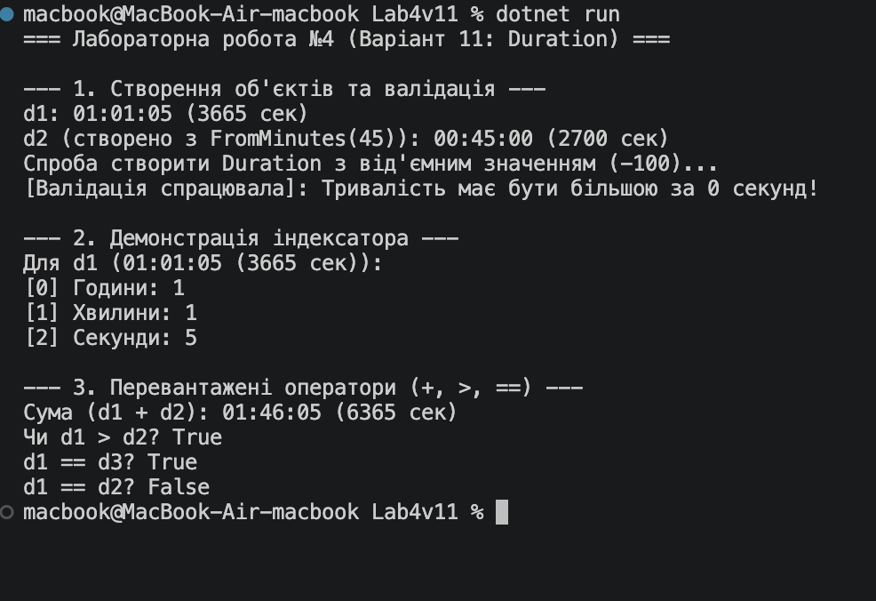

# Лабораторна робота №4

**Тема:** Властивості та статичні члени. Індексатори й перевантаження операторів.  

## Хід роботи

1. Створено консольний проєкт `Lab4v11`.
2. Реалізовано клас `Duration` згідно із завданням варіанту 11:
   - Приватні поля та властивість `TotalSeconds` із валідацією (`> 0`).
   - Статичний метод `FromMinutes(int minutes)`.
   - Індексатор для доступу до годин `[0]`, хвилин `[1]` та секунд `[2]`.
   - Перевантажені оператори `+`, `>`, `<`, `==`, `!=`.
   - Перевизначені методи `ToString()`, `Equals()`, `GetHashCode()`.
3. У `Program.cs` продемонстровано роботу всіх елементів класу.

## Результат

## Відповіді на контрольні запитання

1. **Яка різниця між звичайною властивістю та індексатором?**  
   Звичайна властивість надає доступ до конкретного поля за його іменем (наприклад, `obj.Property`), а індексатор дозволяє звертатися до елементів об'єкта за індексом або ключем через квадратні дужки (наприклад, `obj[0]`), імітуючи поведінку масиву чи словника.

2. **Навіщо потрібно перевизначати Equals() та GetHashCode() при перевантаженні операторів == та !=?**  
   Для забезпечення логічної цілісності мови C#. Оператори `==` та `!=` використовуються для порівняння, але багато системних колекцій (наприклад, `Dictionary`, `HashSet`) та LINQ-методів спираються саме на `Equals()` та `GetHashCode()` для перевірки еквівалентності об'єктів та обчислення хеш-кодів.

3. **У яких випадках доцільно використовувати статичні члени класу?**  
   Статичні члени використовуються для зберігання загального стану або реалізації допоміжних методів/фабрик, які належать усьому класу в цілому, а не конкретному екземпляру (наприклад, константи, лічильники створиних об'єктів, розрахункові функції чи конструювання об'єктів з інших типів даних).

4. **Як інкапсуляція допомагає підтримувати цілісність даних у класі, який ви реалізували?**  
   Завдяки закриттю прямого доступу до приватного поля `_totalSeconds` та наданню доступу лише через властивість із перевіркою `if (value <= 0)`, об'єкт `Duration` захищений від переходу в некоректний або зламаний стан (наприклад, із від'ємним часом).