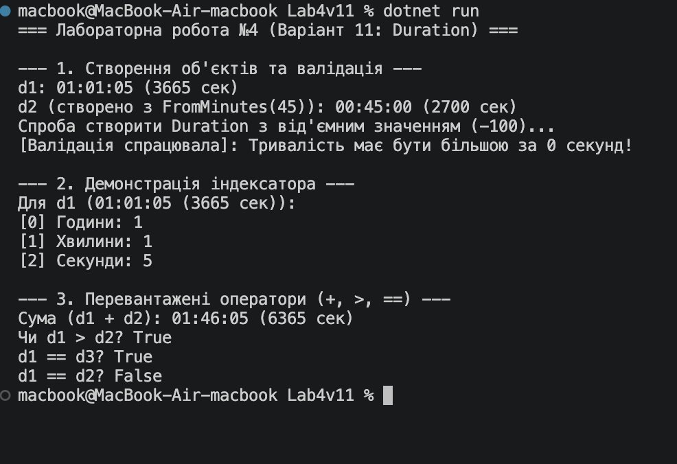

# Лабораторна робота №4

**Тема:** Властивості та статичні члени. Індексатори й перевантаження операторів.  

## Хід роботи

1. Створено консольний проєкт `Lab4v11`.
2. Реалізовано клас `Duration` згідно із завданням варіанту 11:
   - Приватні поля та властивість `TotalSeconds` із валідацією (`> 0`).
   - Статичний метод `FromMinutes(int minutes)`.
   - Індексатор для доступу до годин `[0]`, хвилин `[1]` та секунд `[2]`.
   - Перевантажені оператори `+`, `>`, `<`, `==`, `!=`.
   - Перевизначені методи `ToString()`, `Equals()`, `GetHashCode()`.
3. У `Program.cs` продемонстровано роботу всіх елементів класу.

## Результат

