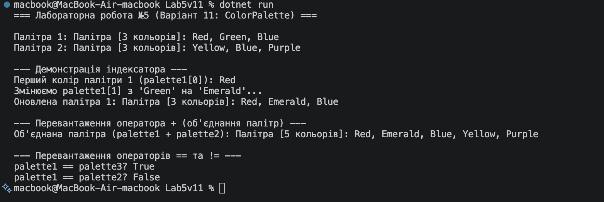

# Лабораторна робота №5

**Тема:** Індексатори та перевантаження операторів.  

## Хід роботи

1. Створено консольний проєкт `Lab5v11`.
2. Реалізовано клас `ColorPalette` згідно із завданням варіанту 11:
   - Приватне поле `List<string> _colors` для збереження списку кольорів.
   - Індексатор `this[int index]` для доступу до кольорів за індексом (читання та зміна значення з перевіркою меж).
   - Перевантажено оператор `+` для об'єднання двох палітр без дублювання кольорів.
   - Перевантажено оператори порівняння `==` та `!=`.
   - Перевизначено методи `ToString()`, `Equals()`, `GetHashCode()`.
   - Реалізовано додаткові методи `AddColor(string color)` та властивість `Count`.
3. У `Program.cs` продемонстровано роботу всіх створених елементів та операторів.

## Результат

## Відповіді на контрольні запитання

1. **Що таке індексатор і для чого він використовується?**  
   Індексатор — це спеціальний член класу, який дозволяє звертатися до екземпляра класу як до масиву або колекції за допомогою синтаксису квадратних дужок `obj[index]` або `obj[key]`. Він використовується для зручного доступу до внутрішніх даних об'єкта.

2. **Яка різниця між індексатором та звичайною властивістю?**  
   Звичайна властивість має ім'я та звертається до конкретного поля/значення через крапку (`obj.Property`), тоді як індексатор викликається через квадратні дужки (`obj[index]`), не має власного імені (використовує `this`) і обов'язково приймає принаймні один параметр індексу або ключа.

3. **Які оператори можна перевантажувати в C#?**  
   У C# можна перевантажувати унарні оператори (`+`, `-`, `!`, `++`, `--`), бінарні арифметичні оператори (`+`, `-`, `*`, `/`, `%`), побітові оператори (`&`, `|`, `^`, `<<`, `>>`), а також оператори порівняння (`==`, `!=`, `<`, `>`, `<=`, `>=`). Не можна перевантажувати оператори присвоєння (`=`), логічні коротка-схема (`&&`, `||`), тернарний (`?:`) та оператори доступу (`.`, `?[]`).

4. **Чому при перевантаженні == та != необхідно також перевизначити Equals() та GetHashCode()?**  
   Це необхідно для забезпечення узгодженості порівняння об'єктів. Більшість системних колекцій, методів LINQ та внутрішніх механізмів .NET перевіряють рівність об'єктів саме через `Equals()` та `GetHashCode()`. Якщо оператор `==` повертає `true`, а `Equals()` повертає `false`, це призведе до логічних помилок у роботі програм.

5. **Як індексатори підвищують читабельність коду?**  
   Вони роблять синтаксис роботи з об'єктами-контейнерами більш природним і лаконічним. Замість виклику громіздких методів на зразок `palette.GetColorAt(0)` або `palette.SetColorAt(0, "Red")` можна використовувати більш зрозумілий і звичний запис `palette[0]` та `palette[0] = "Red"`.