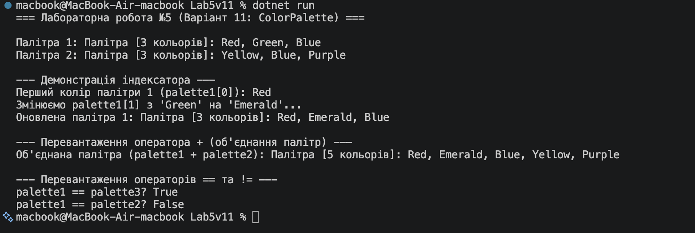

# Лабораторна робота №5

**Тема:** Індексатори та перевантаження операторів.  

## Хід роботи

1. Створено консольний проєкт `Lab5v11`.
2. Реалізовано клас `ColorPalette` згідно із завданням варіанту 11:
   - Приватне поле `List<string> _colors` для збереження списку кольорів.
   - Індексатор `this[int index]` для доступу до кольорів за індексом (читання та зміна значення з перевіркою меж).
   - Перевантажено оператор `+` для об'єднання двох палітр без дублювання кольорів.
   - Перевантажено оператори порівняння `==` та `!=`.
   - Перевизначено методи `ToString()`, `Equals()`, `GetHashCode()`.
   - Реалізовано додаткові методи `AddColor(string color)` та властивість `Count`.
3. У `Program.cs` продемонстровано роботу всіх створених елементів та операторів.

## Результат

