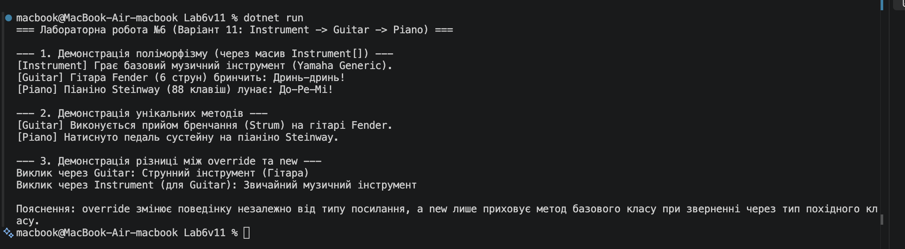

# Лабораторна робота №6

**Тема:** Наслідування. Ключові слова base, override, virtual. Приховування членів (new).  

## Хід роботи

1. Створено консольний проєкт `Lab6v11`.
2. Реалізовано ієрархію класів:
   - Базовий клас `Instrument` із властивостями `Brand`, `Price`, віртуальним методом `PlaySound()` та невіртуальним `GetInstrumentType()`.
   - Похідний клас `Guitar`: викликає `base(...)`, перевизначає `PlaySound()`, додає унікальний метод `Strum()` та використовує `new` для методу `GetInstrumentType()`.
   - Похідний клас `Piano`: викликає `base(...)`, перевизначає `PlaySound()`, додає унікальний метод `PressPedal()`.
3. У `Program.cs` продемонстровано поліморфізм через масив `Instrument[]` та різницю між `override` і `new`.

## Результат

## Відповіді на контрольні запитання

1. **Поясніть принцип наслідування в ООП. Наведіть приклад з реального світу.**  
   Наслідування — це механізм ООП, який дозволяє новому (похідному) класу успадковувати поля, властивості та методи вже існуючого (базового) класу, розширюючи або змінюючи їхню поведінку. Приклад: базовий клас «Транспортний засіб» та похідний клас «Легковий автомобіль», який успадковує загальні характеристики (двигун, швидкість), але додає власні (кількість дверей).

2. **Для чого використовується ключове слово base? Наведіть приклади його застосування.**  
   Ключове слово `base` використовується для доступу до членів базового класу з похідного класу. Приклади: виклик конструктора базового класу (`public Guitar(...) : base(...)`) або виклик перекритого методу базового класу (`base.PlaySound()`).

3. **У чому полягає різниця між virtual та override? Як вони забезпечують поліморфізм?**  
   Модифікатор `virtual` у базовому класі дозволяє перевизначати метод у похідних класах, а `override` у похідному класі надає нову реалізацію цього віртуального методу. Разом вони забезпечують динамічний поліморфізм: виконання відповідного методу залежно від реального типу об'єкта під час виконання програми.

4. **Коли варто використовувати модифікатор new для приховування члена базового класу, і які наслідки це має?**  
   Модифікатор `new` використовується у випадках, коли в похідному класі потрібно оголосити метод із таким самим ім'ям і сигнатурою, як у базовому класі, але без перевизначення (коли метод базового класу не є `virtual`). Наслідок: при зверненні до об'єкта через тип базового класу викликатиметься базовий метод, а при зверненні через тип похідного класу — новий метод.