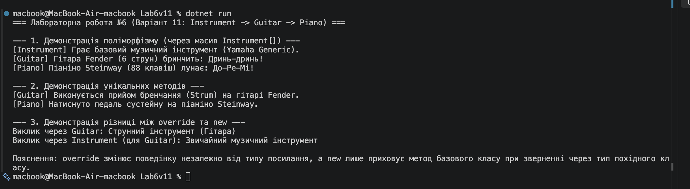

# Лабораторна робота №6

**Тема:** Наслідування. Ключові слова base, override, virtual. Приховування членів (new).  

## Хід роботи

1. Створено консольний проєкт `Lab6v11`.
2. Реалізовано ієрархію класів:
   - Базовий клас `Instrument` із властивостями `Brand`, `Price`, віртуальним методом `PlaySound()` та невіртуальним `GetInstrumentType()`.
   - Похідний клас `Guitar`: викликає `base(...)`, перевизначає `PlaySound()`, додає унікальний метод `Strum()` та використовує `new` для методу `GetInstrumentType()`.
   - Похідний клас `Piano`: викликає `base(...)`, перевизначає `PlaySound()`, додає унікальний метод `PressPedal()`.
3. У `Program.cs` продемонстровано поліморфізм через масив `Instrument[]` та різницю між `override` і `new`.

## Результат

