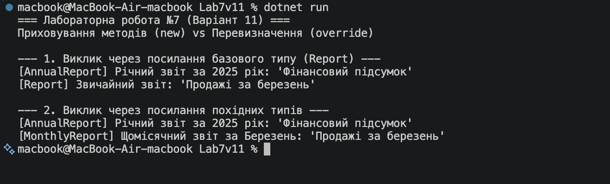

# Лабораторна робота №7 (Варіант 11)

**Тема:** Приховування методів (`new`) vs перевизначення (`override`).

## Хід роботи

1. Створено консольний проєкт `Lab7v11`.
2. Реалізовано ієрархію класів згідно з Варіантом 11:
   - **Базовий клас `Report`**: реалізує віртуальний метод `virtual void Generate()`.
   - **Похідний клас `AnnualReport`**: перевизначає метод через `override void Generate()`.
   - **Похідний клас `MonthlyReport`**: приховує метод через `new void Generate()`.
3. У методі `Main` продемонстровано різницю між статичним та динамічним зв'язуванням під час використання Upcasting (посилання базового типу).

## Результат роботи

## Відповіді на контрольні запитання

1. **У чому полягає різниця між override та new при роботі з методами?**  
   - `override` перевизначає віртуальний метод базового класу, забезпечуючи динамічне зв'язування (поліморфізм). Метод вибирається залежно від **реального типу об'єкта** в пам'яті.  
   - `new` приховує метод базового класу, створюючи абсолютно новий метод із тим самим ім'ям. Зв'язування відбувається статично залежно від **типу посилання** (змінної).

2. **Що таке поліморфізм і як override його забезпечує?**  
   Поліморфізм — це здатність об'єктів різних класів реагувати на один і той самий виклик методу по-різному. Модифікатор `override` перевизначає таблицю віртуальних методів (VMT), завдяки чому при виклику через посилання базового типу виконується код саме похідного класу.

3. **Чому при використанні new не відбувається динамічного зв'язування?**  
   Тому що `new` не пов'язаний із віртуальними таблицями базового класу. Компілятор під час збірки жорстко прив'язує виклик методу до того типу змінної, через яку здійснюється звернення.

4. **Коли доцільно використовувати new замість override?**  
   `new` використовується рідко: коли потрібно додати метод у похідний клас, ім'я якого випадково збігається з методом у базовому класі (наприклад, після оновлення сторонньої бібліотеки), і при цьому не потрібно змінювати поведінку базового класу для існуючих клієнтів.

5. **Що станеться, якщо забути вказати new при приховуванні методу?**  
   Код зкомпілюється і буде працювати так само, як і з `new`, але компілятор видасть попередження (warning) про те, що метод приховує член базового класу, і порадить явно додати `new`.