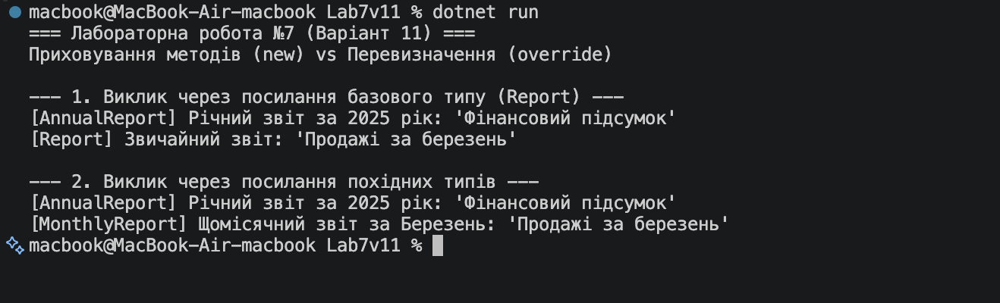

# Лабораторна робота №7 

**Тема:** Приховування методів (`new`) vs перевизначення (`override`).

## Хід роботи

1. Створено консольний проєкт `Lab7v11`.
2. Реалізовано ієрархію класів згідно з Варіантом 11:
   - **Базовий клас `Report`**: реалізує віртуальний метод `virtual void Generate()`.
   - **Похідний клас `AnnualReport`**: перевизначає метод через `override void Generate()`.
   - **Похідний клас `MonthlyReport`**: приховує метод через `new void Generate()`.
3. У методі `Main` продемонстровано різницю між статичним та динамічним зв'язуванням під час використання Upcasting (посилання базового типу).

## Результат роботи

