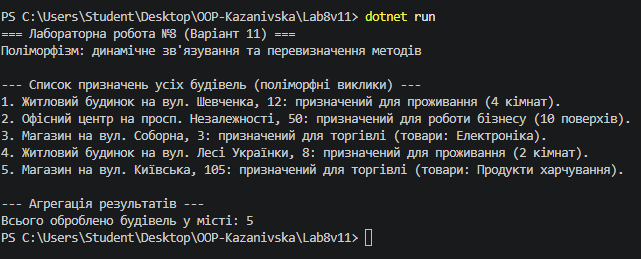

# Лабораторна робота №8 

**Тема:** Поліморфізм: динамічне зв'язування та перевизначення методів.

## Хід роботи

1. Створено консольний проєкт `Lab8v11`.
2. Реалізовано ієрархію класів згідно з Варіантом 11:
   - **Базовий клас `Building`**: містить властивість `Address` та віртуальний метод `virtual void GetPurpose()`.
   - **Похідний клас `House`**: перевизначає `GetPurpose()`, додає властивість `NumRooms`.
   - **Похідний клас `Office`**: перевизначає `GetPurpose()`, додає властивість `NumFloors`.
   - **Похідний клас `Shop`**: перевизначає `GetPurpose()`, додає властивість `ProductType`.
3. У методі `Main` створено колекцію `List<Building>`, до якої додано екземпляри всіх похідних класів.
4. Продемонстровано поліморфний виклик методу `GetPurpose()` у циклі `foreach` та виконано агрегацію оброблених об'єктів.

## Результат виконання

