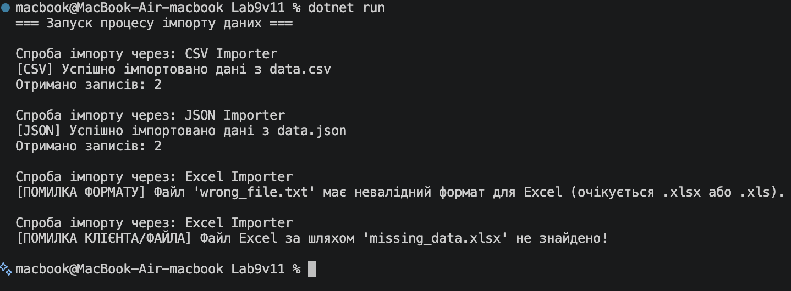

# Лабораторна робота №9 (Варіант 11)

**Тема:** Поліморфні сервіси: DataImporter (Excel/CSV/JSON).

## Хід роботи

1. Створено консольний проєкт `Lab9v11`.
2. Реалізовано абстрактний базовий клас `DataImporter` з абстрактним методом `Import(string filePath)`.
3. Створено 3 похідні класи з власною логікою валідації формату та обробки даних:
   - `ExcelImporter` (перевірка розширення `.xlsx`/`.xls`)
   - `CSVImporter` (перевірка розширення `.csv`)
   - `JSONImporter` (перевірка розширення `.json`)
4. Створено клас-сервіс `ImportService` з методом `ProcessAllImports`, який обробляє список об'єктів базового типу та безпечно перехоплює винятки (`try-catch`).
5. У методі `Main` продемонстровано поліморфний виклик імпорту та навмисно викликано винятки невалідного формату і відсутності файла.

## Результат виконання

